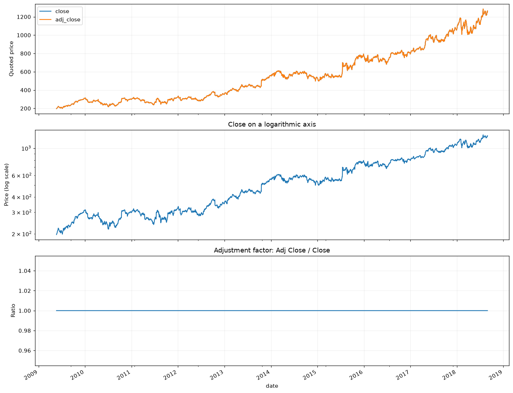
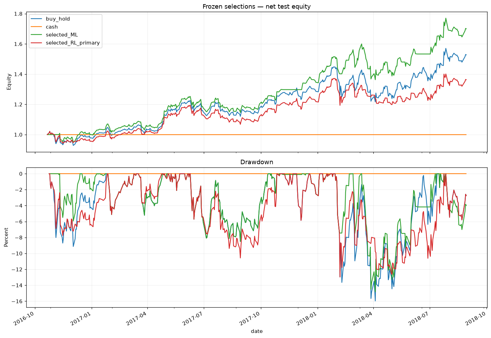
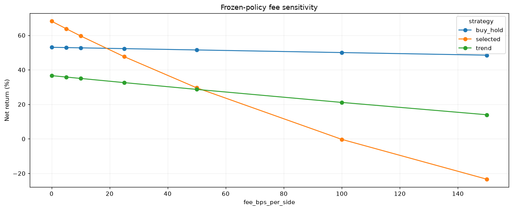

# GOOGL Research Model

Historical EDA, machine-learning and reinforcement-learning experiments for Google (`GOOGL`), plus a local prediction API, Streamlit dashboard, and paper-trading ledger.

**Research software only.** The model uses historical data, is not investment advice, and never places real trades. Live prices are fetched from Yahoo Finance through `yfinance`.

## Contents

### Research notebooks

1. [`GOOGL_In_Depth_EDA.ipynb`](GOOGL_In_Depth_EDA.ipynb) — provenance, data quality, returns, drawdowns, volatility, dependence, stationarity, volume, and calendar diagnostics.
2. [`Corrected_G_Learning_Experiments.ipynb`](Corrected_G_Learning_Experiments.ipynb) — cost-based G-learning/KL backups, adaptive curricula, hierarchy, and execution-seed sensitivity.
3. [`ML_and_RL_Strategy_Experiments.ipynb`](ML_and_RL_Strategy_Experiments.ipynb) — supervised classifiers, trading rules, and alternative RL strategies.


### Application

- [`dashboard.py`](dashboard.py) — Streamlit charts, comparisons, signal history, a simple fee-aware backtest, and paper-trade recording.
- [`api.py`](api.py) — FastAPI endpoints for quotes, predictions, signal history, and paper trades.
- [`deployment_pipeline.py`](deployment_pipeline.py) — feature engineering and local prediction logic.
- [`models/logistic_top8.joblib`](models/logistic_top8.joblib) — fitted deployment model.
- [`models/logistic_top8_metadata.json`](models/logistic_top8_metadata.json) — model version, threshold, feature schema, and training metadata.
- [`models/paper_trading.sqlite3`](models/paper_trading.sqlite3) — local SQLite paper-trading ledger.


## Historical data and findings

The notebooks use `gym_anytrading.datasets.STOCKS_GOOGL`, bundled with `gym-anytrading==2.0.0`: 2,335 daily observations from 2009-05-22 through 2018-08-29. The application uses current daily OHLCV data from Yahoo Finance.


These are retrospective results, not evidence of future performance. See [`experiment_outputs/`](experiment_outputs/) and [`ml_rl_outputs/`](ml_rl_outputs/) for metrics, paths, sensitivity analyses, and conclusions.







## Installation

Python 3.11 was used for the saved runs. From the repository root:

```bash
python -m venv .venv
source .venv/bin/activate       
python -m pip install --upgrade pip
python -m pip install -r requirements-app.txt
python -m pip install numpy pandas scikit-learn gym-anytrading joblib
```

To rerun notebooks, also install:

```bash
python -m pip install jupyterlab matplotlib scipy statsmodels nbformat nbclient ipykernel
python -m ipykernel install --user --name googl-research --display-name "Python (GOOGL research)"
```

## Run the application

### Streamlit dashboard

```bash
streamlit run dashboard.py
```

The dashboard defaults to `GOOGL` and supports `1y`, `2y`, and `5y` histories. It can compare symbols, display moving averages and RSI, download prices/signals/backtests, and save signals locally as paper trades. It never sends orders to a broker.

### FastAPI service

```bash
uvicorn api:app --reload --host 0.0.0.0 --port 8000
```

Endpoints:

```text
GET  /health
GET  /quote/{symbol}?period=3mo
GET  /predict/{symbol}?period=2y
GET  /backtest/{symbol}?period=2y
POST /paper-trading/record/{symbol}?period=2y
GET  /paper-trading/trades?limit=50
```

Example:

```bash
curl http://localhost:8000/predict/GOOGL
curl -X POST http://localhost:8000/paper-trading/record/GOOGL
```

Market-data endpoints require internet access. `period` must use values such as `3mo`, `2y`, or `5d`.

### Docker

The included [`Dockerfile`](Dockerfile) starts the FastAPI service on port `8000`:

```bash
docker build -t googl-research-api .
docker run --rm -p 8000:8000 googl-research-api
```

The container is API-only; run the Streamlit dashboard in the Python environment.

## Outputs

- [`docs/images/`](docs/images/) — research figures.
- [`experiment_outputs/`](experiment_outputs/) — corrected G-learning metrics and audit files.
- [`ml_rl_outputs/`](ml_rl_outputs/) — ML/RL metrics, execution paths, bootstrap results, and conclusions.
- [`models/`](models/) — deployment model, metadata, and local paper-trading database.

